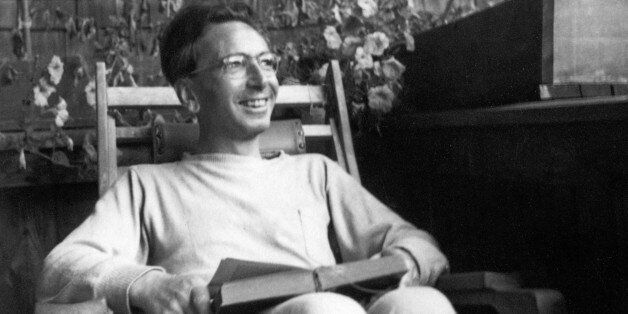

--- 
title: "The Doctor and the Soul"
date: "December 22, 2021"
---

&nbsp;

## On the Meaning of Life

Logotherapy, and existential analysis more generally, centers on the assumption of man’s fundamental responsibility. It therefore aims to make people more conscious of this very responsibility towards life. 

&nbsp;

There are many ways that the individual seeks out self-forgetfulness as a way of alleviate this consciousness of responsibility, one of which ways being the adoption of the “presentist” attitude, which rejects any concern for direction toward the future and lives entirely in the pure present. But despite attempts to numb awareness of responsibility, man’s fundamental obligation to realize values creatively remains. 

&nbsp;

It is futile to ask the question of the universe or life as a whole, since the whole always transcends the limits of our ability to know. Meaning, then, is to be found in the concrete situations of individual beings, given their particular being. 

&nbsp;

Many people falsely believe that the whole point of life is the acquisition of pleasure. Pleasure though is more a side effect of moving towards or obtaining what we actually want. If we accept pleasure as the ultimate end of all means, we level the various human aims to a homogeneous group of means that are intended toward the same end: pleasure. Pleasure, according to Frankl, is not what we’re after; what we want is meaning and content in our lives. 

&nbsp;

The pursuit of pleasure, happiness, or meaning as a goal in and of itself is doomed to fail because these are not the result of a direct pursuit. Rather, they accompany other activities which in themselves may be unpleasurable, and difficult. 

&nbsp;

The uniqueness and singularity of each individual and his situation suggests specific values to be realized creatively by concrete acts. Logotherapy aims to help the patient fill his life with content by helping them “find an aim and a purpose in their existence—in other words, to show them the task before them.” 

&nbsp;

	
“We venture to say that nothing is more likely to help a person overcome or endure objective difficulties or subjective troubles than the consciousness of having a task in life. This is all he more so when the task seems to be personally cut to suit, as it were; when it constitutes what may be called a mission. Having such a task makes the person irreplaceable and gives his life the value of uniqueness.”

&nbsp;

Existence is a constant effort to actualize values; these values are individual and are actualized through specific tasks. The goal is to make the patient aware of and then dedicated to the unique goal that his individual life possesses and towards which only one path exists. 

&nbsp;

If one doesn’t know what his unique task is, if his unique potentialities are not known, then ‘his primary task is to find his way to his own proper task, to advance toward the uniqueness and singularity of his own meaning in life.”  The individual must know what his unique potentialities are, and when these are known, he is then existentially obligated to actualize them, or else deep guilt will engulf him. We can take advice from Goethe: “How can we learn to know ourselves? Never by reflection, but by action. Try to do your duty and you will soon find out who you are.” Essentially, listen to your conscience; it seems to know what needs to be done, what constitutes the proper development of one’s inner potentialities. 

&nbsp;

## On the Meaning of Death

Death does not make life meaningless; in fact, it is the very foundation for a sense of the meaningfulness of life. The finitude of life is what gives man the responsibility to make something of it. You can therefore interpret the widespread belief in an eternity not as a fear of death, but as a way of avoiding the heavy responsibility of living life fully—i.e. as a fear of life! 

&nbsp;

The view that the meaning of life is merely its continuation is also tenuous. “Either life has a meaning and retains this meaning whether it is long or short, whether or not it reproduces itself; or life has no meaning, in which case it takes on none, no matter how long it lasts or can go on reproducing itself. . . . The propagation of life has meaning only if life in itself represents something meaningful.”

&nbsp;

“The more highly differentiated a man is, the less he resembles the norm—norm in both in the sense of average and in the sense of ideal. At the price of normality, or as the case may be, ideality, he has baught his individuality.” 

&nbsp;

The mass necessarily aims towards the leveling out of individuality toward a homogenous mass of identical automatons. The tendency of individuals to submerge themselves into the mass is motivated by the desire to relieve themselves of the burden of individuality. It also relieves the person judging of the responsibility of judging individuals; they rather group everyone together into a homogenous group and judging the whole while ignoring the variation of individuals that make up groups. 

&nbsp;

One could look at the uniqueness of one’s potentialities as one’s destiny, which is the single set of circumstances that belong to one’s individual being alone. 

&nbsp;

“Being human is being responsible because it is being free. . .  There is a multitude of different possibilities in his being, of which he actualizes only a single one and in so doing delineates his existence as such. During no moment of his life does man escape the mandate to choose among possibilities. Yet he can pretend to act ‘as if’ he had no choice and no freedom of decision.”

&nbsp;

## On the Meaning of Suffering

The meaning of something is independent of whether or not is “succeeded;” often, our failures carry with them more meaning and richness than our successes. Meaning is also independent of pleasure, so a lack of pleasure in life does not necessarily mean that the life is meaningless. 

&nbsp;

In the case of  a person who has a strong negative judgement of himself, who suffers the agonizing tension between what he is and what he could be, he can at least stand in the conviction that, since he is able to even envision an ideal and to see the potential within himself, he is worthy and valuable. It is also valuable to see this tension as an essentially fruitful one: “Suffering therefore establishes a fruitful, one might say a revolutionary, tension in that it makes for emotional awareness of what ought not to be.”

&nbsp;

Even the suffering of boredom—which is a form of suffering not to be underestimated—has meaning: “Boredom is a continual reminder. What leads to boredom? Inactivity. But activity does not exist for our escaping boredom; rather, boredom exists so that we will escape in activity and do justice to the meaning of our life.”

&nbsp;

Ultimately, suffering is a sign that we are still psychologically alive; the presence of pain keeps us from spiraling into complete apathy and emptiness. Usually, suffering pushes us to grow, and in the facing and braving through suffering, we become stronger and wiser. This is why attempts to avoid or numb suffering are futile and self-defeating. Such means only dull the symptom of the underlying problem—which is usually spiritual emptiness—and does not touch the problem itself. 

&nbsp;

Suffering, therefore, is a call from deep within. It is a symptom of spiritual distress, of existential dissatisfaction. It’s proper function is to awaken us from our sleep and move us in the right direction; but in order for this to take place, we must first accept the suffering for what it is, comprehend it’s meaning and purpose, and then use it as fuel for overcoming it. 

	
## On the Meaning of Work

People like to feel their uniqueness and singularity expressed, at least to some degree, in their work. But this is often a function of the person rather than the job itself; i.e. it’s up to the individual to bring his unique self to his work in such a way that he is indispensable, even if the majority of the tasks required could be performed by anyone, or by a machine. This of course is not always an available option, such as in people who work so hard merely toward the end of money that they have no ability to shape their leisure meaningfully. 

&nbsp;

Others who work merely as a means to the end of money have only their “off-time” to make their lives meaningful; but the vast majority of people do not know how to properly shape their leisure to be fulfilling and meaningful. Rather, they tend toward passive consumption and “relaxing,” and thus even their free time is ultimately empty. This is obvious when someone who otherwise works full-time is met with a situation whereby they have a leave of absence from work. What is the common result? They go “stir crazy” and don’t know what to do with themselves because they haven’t developed the inner discipline required to structure one’s own time in a meaningful way. So they spend hours in front of the TV every day desperately attempting to relieve themselves of this unpleasant feeling. 

&nbsp;

This phenomenon is made clear in what is termed unemployment neurosis. (left off on p.138)
